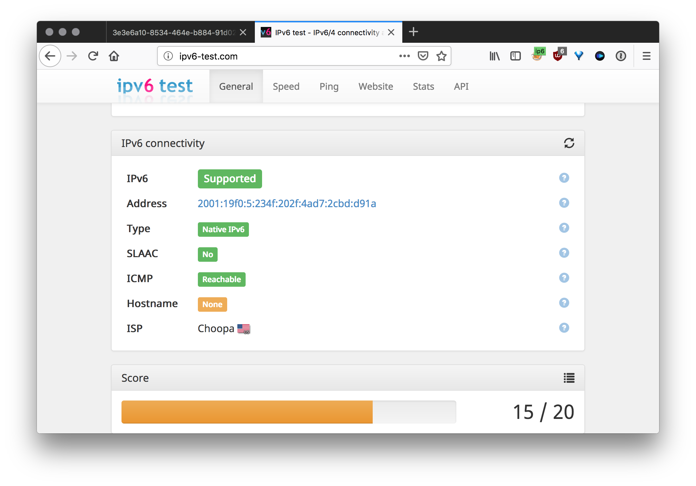

26.11.20 Added Centos 8 support

Redirect connections from different ports at one ipv4 address to unique random ipv6 address from \64 subnetwork. Based on 3proxy

## Requirements
- Centos 8
- Ipv6 \64

## Installation
[Video tutorial](https://xuanduong.carrd.co), VPS from [Facebook *Admin*](https://www.facebook.com/dignile) used as Centos setup

1. `bash <(curl -s "https://raw.githubusercontent.com/lexuanduongvip/ipv4-ipv6-proxy-master/main/scripts/install.sh")`

1. After installation dowload the file `proxy.zip`
   * File structure: `IP4:PORT:LOGIN:PASS`
   * You can use this online [util](http://buyproxies.org/panel/format.php
) to change proxy format as you like

## Test your proxy

Install [FoxyProxy](https://addons.mozilla.org/en-US/firefox/addon/foxyproxy-standard/) in Firefox

Open [ipv6-test.com](http://ipv6-test.com/) and check your connection

